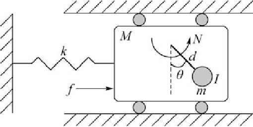

# Robust Control of Rotational/Translational Actuator (RTAC) System
This code is an appendix for final project of Teknik Kendali Lanjut (Advanced Control Engineering) course (TKEE163125) in Universitas Gadjah Mada

## Requirement:
* Matlab® R2016a or later
* Microsoft Office Word 2013

Contributor: Resha Dwika Hefni Al-Fahsi, Vicko Pranowo, Bagas Budhi Permana.

Special Thanks to: Bagaskara Primastya Putra, Julham Effendi, Sudiro, Muhammad Haritsah Muklis, Abdan Hanifan Dharmasakya.